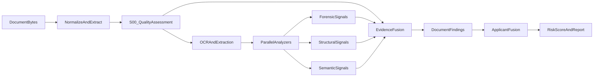
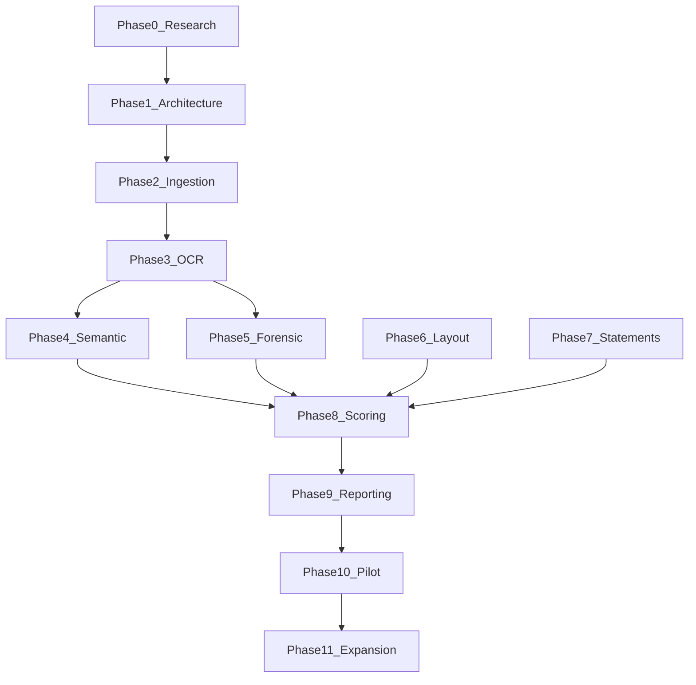
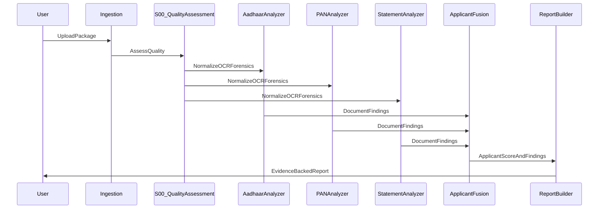

# KYCShield AI — Phase 0 Research & Planning Document

**Status: SIGNED OFF** (2026-06-17)

Approved: Fraud Taxonomy, Threat Model, MVP Scope, Risk Strategy, Explainability Requirements, Success Metrics, Roadmap, OSS-First Constraint.

Post-approval refinements incorporated: **S00 Document Quality Assessment (P0)** and **Bank Statement scope limited to top 5 Indian banks**.

---

## 1. Executive Summary

**KYCShield AI** is a pre-verification trust layer that answers one question: *"Does this document exhibit signs of tampering, forgery, manipulation, or synthetic generation?"* It does **not** answer whether an identity is valid, whether a PAN exists in government records, or whether a bank account is real.

The MVP targets three Indian KYC document types — **Aadhaar Card**, **PAN Card**, and **Bank Statement** — in mixed image (JPG/JPEG/PNG) and PDF formats. Analysis runs **locally** using **open-source** forensic and ML tooling, producing **document-level and applicant-level risk scores** with **evidence-backed, human-readable findings**.

**Core thesis:** Traditional KYC pipelines optimize for *validity* (format checks, OCR extraction, API lookups). Fraudsters exploit the gap between *valid-looking* and *authentic* documents. KYCShield closes that gap with cheap, explainable pre-screening before expensive downstream verification.

**Recommended MVP posture:** A **rules + forensic signal fusion engine** with document-type-specific analyzers, conservative risk thresholds, and mandatory evidence artifacts (annotated regions, signal summaries). Avoid building a general "AI fake detector" — instead, stack weak-but-explainable signals that compound under manipulation.

**Key blind spots to acknowledge upfront:**
- Scanned physical documents and phone photos will dominate real uploads; pixel-level forensics degrade quickly — mitigated by **S00 Document Quality Assessment** gating forensic confidence.
- Bank statements have unbounded layout diversity — MVP explicitly scopes to **top 5 banks only** (SBI, HDFC, ICICI, Axis, Kotak); unsupported banks return `Inconclusive` with clear messaging.
- Without labeled tampered datasets, MVP accuracy must be measured on **expert-reviewed synthetic test sets**, not production ground truth.
- The system cannot prove authenticity — only raise suspicion with evidence.

---

## 2. Problem Definition

### 2.1 Current State

Organizations collecting KYC packages (Aadhaar + PAN + Bank Statement) typically:

1. Accept uploads via web/mobile
2. Run OCR and field extraction
3. Optionally call verification APIs (PAN validation, penny drop, etc.)
4. Route to manual review on mismatch or policy triggers

**Failure mode:** A skillfully edited PDF or Photoshop-manipulated Aadhaar passes format validation and OCR because the *content looks correct*. Verification APIs may not run until late in the funnel, or may not detect local tampering at all (e.g., edited bank statement balance with correct IFSC).

### 2.2 Problem Statement

> Organizations lack a low-cost, explainable, pre-KYC screening capability that detects document tampering and synthetic generation indicators in Indian KYC uploads before investing verification effort.

### 2.3 What KYCShield Is / Is Not

| KYCShield IS | KYCShield IS NOT |
|---|---|
| Forensic tampering pre-screener | Identity verification system |
| Trustworthiness evaluator | Government record lookup |
| Evidence generator for analysts | Final fraud adjudication |
| Applicant-package risk aggregator | AML/sanctions screening |
| Local, OSS-first analyzer | Cloud API orchestration layer |

### 2.4 Document Input Reality

Users upload **Applicant Packages** containing 1–3 document types in arbitrary combinations and formats:

- **Images:** JPG, JPEG, PNG (phone photos, scans, screenshots)
- **Documents:** PDF (native digital, scanned, or hybrid)

The system must normalize inputs to an analyzable representation without assuming high quality or consistent layout.

---

## 3. Business Value

### 3.1 Value Proposition by Stakeholder

| Stakeholder | Value |
|---|---|
| **KYC Operations** | Auto-triage suspicious uploads; reduce manual review volume |
| **Fraud / Investigations** | Structured evidence pack for escalation |
| **Compliance** | Audit trail of screening rationale (explainability) |
| **Product / Lending** | Faster funnel by rejecting bad docs early |
| **Engineering** | Decoupled trust layer; no vendor lock-in |

### 3.2 Economic Logic

- **Cost avoided:** Manual review minutes, downstream verification API calls, fraud losses from approved bad applications
- **Cost incurred:** Local compute per package (CPU/GPU), analyst time on flagged cases
- **Break-even hypothesis:** If pre-screening removes even 5–10% of manual review load or prevents a small number of high-value fraud approvals, ROI is positive given local OSS execution

### 3.3 Competitive Differentiation (Research-Level)

- **Pre-KYC placement** (before verification, not after)
- **Forensic + structural signals** (not just OCR confidence)
- **Cross-document consistency** at applicant level (name/DOB/PAN alignment)
- **Explainability-first** (regulatory and ops friendly in Indian financial context)

---

## 4. Threat Model

### 4.1 Threat Model Scope

**Assets:** Uploaded KYC documents (Aadhaar, PAN, Bank Statement) and derived applicant identity fields.

**Adversaries:**
- **Casual fraudster:** Mobile editing apps, PDF editors, online "fake document" generators
- **Organized fraud ring:** Template libraries, batch Photoshop, synthetic ID pipelines
- **Insider-assisted:** Legitimate document + targeted field edits
- **Synthetic/AI adversary:** Diffusion/GAN-generated documents, inpainting, deepfake face swap on ID photo

**Trust boundaries:**
- User-controlled upload channel (untrusted input)
- KYCShield analysis environment (must treat all bytes as hostile)
- Downstream verification (out of scope but consumer of KYCShield output)

### 4.2 STRIDE-Oriented View (Upload Channel)

| Category | Relevant Threat | KYCShield Response |
|---|---|---|
| **Spoofing** | Entire fake document submission | Layout/template + synthetic signal checks |
| **Tampering** | Field/region edits | ELA, compression, OCR-layout mismatch |
| **Repudiation** | "I didn't upload that" | Out of scope (logging/audit is Phase 2+) |
| **Information Disclosure** | PII in logs | Minimize retention; local processing |
| **Denial of Service** | Huge PDFs, zip bombs | Input limits, timeouts (Phase 1) |
| **Elevation** | Malware in PDF | Sandboxed parsing; no execution |

### 4.3 Document-Specific Threat Scenarios

#### Aadhaar Card

| Scenario | Attack Description | Likely Adversary Tier | Detectability |
|---|---|---|---|
| A1 Photo replacement | Swap face in ID photo region | Casual–Organized | Medium (ELA, face boundary) |
| A2 Name modification | Edit holder name text | Casual–Organized | Medium–High (font/OCR/ELA) |
| A3 Address modification | Edit address block | Casual–Organized | Medium |
| A4 Aadhaar number modification | Change 12-digit UID | Organized | Medium (checksum + OCR + font) |
| A5 DOB/Gender/YOB edits | Demographic field tampering | Casual | Medium |
| A6 QR manipulation | Replace/regenerate QR | Organized | Medium (QR decode vs visible text) |
| A7 VID/masked Aadhaar abuse | Partial legit + synthetic overlay | Casual | Low–Medium |
| A8 Entire fake Aadhaar | Template + synthetic generation | Organized–AI | Low–Medium (layout + synth signals) |
| A9 Scan-of-scan / reprint | Physical re-capture to hide edits | Casual | Low (forensics degraded) |
| A10 e-Aadhaar PDF tampering | Edit native PDF text layers | Casual–Organized | Medium–High (PDF structure) |

#### PAN Card

| Scenario | Attack Description | Likely Adversary Tier | Detectability |
|---|---|---|---|
| P1 PAN number modification | Alter 10-char alphanumeric | Organized | Medium (format + font + OCR) |
| P2 Name modification | Edit name field | Casual | Medium |
| P3 Father's name modification | Edit secondary identity field | Casual | Medium |
| P4 DOB modification | Date tampering | Casual | Medium |
| P5 Photo replacement | Face swap on card photo | Organized | Medium |
| P6 Signature manipulation | Paste signature | Casual–Organized | Medium (ELA on sig region) |
| P7 Hologram/background paste | Copy security background | Organized | Low–Medium |
| P8 Entire fake PAN generation | Template-based fake | Organized–AI | Low–Medium |
| P9 Old/new PAN layout confusion | Submit wrong card version | Casual (error) | Medium (template mismatch) |

#### Bank Statement

| Scenario | Attack Description | Likely Adversary Tier | Detectability |
|---|---|---|---|
| B1 Balance modification | Edit closing/available balance | Casual | Medium (font, PDF text object) |
| B2 Transaction insertion | Add fake credit entries | Casual–Organized | Medium (table alignment, ref #) |
| B3 Transaction deletion | Remove debits | Casual | Medium |
| B4 Account holder modification | Change name on header | Casual | Medium |
| B5 Account number / IFSC edit | Alter routing identifiers | Organized | Medium–High (cross-field consistency) |
| B6 Statement period manipulation | Change date range | Casual | Medium |
| B7 Fake statement generation | Full synthetic from template | Organized–AI | Low–Medium |
| B8 PDF metadata backdating | Alter CreationDate/Producer | Casual | Medium (metadata vs content dates) |
| B9 Image statement photoshop | Screenshot/photo of edited UI | Casual | Medium (UI consistency) |
| B10 Legitimate statement + overlay | White box + text overlay | Casual | Medium–High (ELA) |

### 4.4 Applicant-Level Threats (Cross-Document)

| Scenario | Description |
|---|---|
| X1 Identity stitching | Real Aadhaar + fake PAN with mismatched name |
| X2 Partial legit package | One authentic doc, two tampered |
| X3 Recycled documents | Same docs reused across applicants (duplicate detection — future) |
| X4 Consistency fraud | All docs individually plausible but mutually inconsistent (DOB, name transliteration, PAN name vs Aadhaar name) |

---

## 5. Fraud Taxonomy

Structured classification used for findings tagging, reporting, and future model training.

```mermaid
flowchart TD
  subgraph taxonomy [FraudTaxonomy]
    VF[VisualForgery]
    MM[MetadataManipulation]
    CM[ContentManipulation]
    LM[LayoutManipulation]
    SG[SyntheticGeneration]
  end
  VF --> VF1[RegionReplacement]
  VF --> VF2[Splicing]
  VF --> VF3[CopyMove]
  VF --> VF4[Inpainting]
  MM --> MM1[EXIFInconsistency]
  MM --> MM2[PDFProducerAnomaly]
  MM --> MM3[TimestampMismatch]
  CM --> CM1[TextFieldEdit]
  CM --> CM2[NumericFieldEdit]
  CM --> CM3[QRBarcodeMismatch]
  CM --> CM4[TransactionEdit]
  LM --> LM1[TemplateDeviation]
  LM --> LM2[FontAnomaly]
  LM --> LM3[SpacingAlignmentDrift]
  LM --> LM4[MissingSecurityElements]
  SG --> SG1[FullySyntheticDoc]
  SG --> SG2[AIGeneratedRegion]
  SG --> SG3[DeepfakePhoto]
  SG --> SG4[TemplateHallucination]
```



### 5.1 Category Definitions

| Category | Definition | Example Indicators |
|---|---|---|
| **Visual Forgery** | Pixel-level manipulation of image regions without coherent document structure change | ELA hotspots, splice boundaries, noise inconsistency |
| **Metadata Manipulation** | File-level properties altered to misrepresent origin or time | EXIF software tags, PDF Producer/Creator, modified dates |
| **Content Manipulation** | Semantic field values changed (text, numbers, codes) | OCR vs QR mismatch, invalid PAN checksum, impossible dates |
| **Layout Manipulation** | Document structure deviates from known authentic templates | Wrong fonts, misaligned tables, missing mandatory fields |
| **Synthetic Generation** | Document or region created by generative AI or template engines | GAN/diffusion artifacts, lack of scan noise, perfect uniformity |

### 5.2 Severity Classes (for findings, not final score weights)

| Class | Meaning |
|---|---|
| **Critical** | Strong evidence of intentional deception (e.g., QR text ≠ visible UID) |
| **High** | Multiple corroborating weak signals in same region |
| **Medium** | Single strong or dual weak signals |
| **Low** | Anomaly with plausible benign explanation |
| **Informational** | Quality/layout note; not necessarily fraud |

---

## 6. Attack Surface Analysis

### 6.1 Attack Surface by Document Type

#### Aadhaar — How Attackers Modify & What Remains

| Vector | Common Tools | Forensic Traces |
|---|---|---|
| Mobile photo editors (Snapseed, PicsArt) | Touch retouch, clone stamp | JPEG recompression blocks; ELA boundaries around photo/text |
| Photoshop/GIMP | Layer edits, content-aware fill | DCT coefficient inconsistencies; color noise variance |
| PDF editors (Adobe, online) | Text object replacement | Incremental save objects; font subset mismatch; text rendering mode |
| Fake generators (web templates) | HTML→PDF, Canva | Missing microtext; wrong dimensions; no authentic scan grain |
| QR replacers | Custom QR libs | Decoded QR payload ≠ OCR fields; error correction anomalies |
| AI inpainting | SD inpaint, DALL·E edit | Texture repetition; unnatural edges; lack of print aliasing |

**Aadhaar-specific structural anchors:** UID format (Verhoeff checksum), QR XML payload structure, standard layout zones (photo, address, logo, issue date), e-Aadhaar PDF digital signature presence (informational only — not validation).

#### PAN — How Attackers Modify & What Remains

| Vector | Common Tools | Forensic Traces |
|---|---|---|
| Field text overlay | White rectangle + typed text | Font weight/rendering mismatch; subpixel misalignment |
| Photo swap | Face swap apps, Photoshop | Face boundary ELA; lighting direction mismatch |
| Signature paste | Image paste | Resolution mismatch; no pen pressure continuity |
| Full template fake | Online PAN makers | Wrong hologram pattern; incorrect PAN 4th char entity type rules |
| Scan manipulation | Print-edit-scan | Double JPEG compression; paper texture breaks |

**PAN-specific structural anchors:** PAN format regex + 4th character entity type heuristic, ITD layout conventions (old vs new card), name/DOB/father name positional relationships.

#### Bank Statement — How Attackers Modify & What Remains

| Vector | Common Tools | Forensic Traces |
|---|---|---|
| PDF text edit | Adobe Acrobat, PDF Expert | Text object bounding box misalignment; non-embedded fonts |
| Excel→PDF regenerated fake | Spoofed bank template | Missing bank-specific metadata; wrong pagination/footer |
| Screenshot editing | Phone markup tools | Status bar inconsistencies; UI font drift |
| Transaction row insertion | Table row clone | Row height/font drift; running balance arithmetic errors |
| HTML phishing statement | Fake bank portal | URL artifacts in PDF (if printed); missing legal disclaimers |

**Bank statement anchors:** Running balance consistency, date ordering, reference number patterns (bank-specific heuristics), IFSC format, header/footer boilerplate.

### 6.2 Input-Format Attack Surface

| Format | Unique Risks | Analysis Implications |
|---|---|---|
| **JPEG/JPG** | Double compression, social-media re-upload | ELA meaningful; EXIF may be stripped |
| **PNG** | Lossless but may overlay edits | ELA less meaningful; metadata often minimal |
| **PDF (native)** | Hidden text layers, incremental updates | Structural parsing essential |
| **PDF (scanned)** | Image-only pages | Treat as image pipeline per page |
| **Mixed package** | Different quality per doc | Applicant score must handle weak signals gracefully |

---

## 7. Forensic Signal Catalog

Each signal is a **candidate feature** for the fusion engine. MVP should implement a subset marked **P0**.

### 7.0 Document Quality Assessment Layer (S00) — P0 Gate

**Pipeline position:** Quality Assessment runs **before** OCR and forensics. Poor-quality inputs must not trigger forensic false positives.

```text
Upload → Quality Assessment (S00) → OCR → Forensics → Scoring
```

| Check | Purpose |
|---|---|
| **Blur score** | Detect out-of-focus phone photos; down-weight Tier C signals |
| **Resolution / DPI** | Flag undersized uploads; cap forensic confidence |
| **Rotation / skew** | Identify misaligned captures; optional deskew before OCR |
| **Cropping completeness** | Detect partial document cuts; flag missing mandatory regions |
| **Overexposure** | Highlight washed-out regions where OCR/ELA unreliable |
| **Underexposure** | Highlight dark regions with lost detail |

**Why P0:** WhatsApp-forwarded images, screenshots, and low-resolution scans are the dominant failure mode for ELA, compression analysis, and noise-based signals. S00 produces:

- A **quality profile** per document (scores + pass/warn/fail thresholds)
- **Informational findings** when quality limits analysis
- **Confidence caps** on Tier C forensic signals when quality is below threshold
- **`Inconclusive` band eligibility** when quality is too poor for reliable assessment

S00 is not a fraud signal — it is a **precondition layer** that prevents the scoring engine from over-interpreting degraded inputs.

### 7.1 Signal Reference Table

| Signal ID | Signal | Why It Works | Strengths | Weaknesses | FP Risk | MVP Priority |
|---|---|---|---|---|---|---|
| S00 | **Document Quality Assessment** | Forensic signals fail on degraded inputs; quality gating reduces FP | Prevents ELA/OCR false alarms; explainable | Does not detect fraud directly | Low (informational) | **P0** |
| S01 | **Error Level Analysis (ELA)** | Recompression leaves different error levels in edited vs original regions | Fast; visual evidence; OSS (OpenCV/PIL) | Useless on PNG rescans; phone photos noisy | High on screenshots | **P0** |
| S02 | **Double JPEG detection** | Edit-save cycles create periodic DCT artifacts | Strong for JPEG edit chains | Not applicable to PNG/PDF-native | Medium | P1 |
| S03 | **Noise inconsistency (PRNU-lite)** | Sensor noise patterns differ in spliced regions | Good on same-camera splices | Needs reference; weak on scans | Medium | P2 |
| S04 | **EXIF/metadata audit** | Editing tools leave Software/ModifyDate traces | Easy; explainable | Often stripped; easily spoofed | Low–Medium | **P0** |
| S05 | **PDF structure forensics** | Incremental updates, object streams, font embedding reveal edits | Strong on native PDF tampering | Scanned PDFs have no structure | Low on scans | **P0** |
| S06 | **PDF metadata cross-check** | CreationDate vs statement period mismatch | Simple rule | Easily edited metadata | Medium | **P0** |
| S07 | **OCR field extraction + validation** | Enables checksums and format rules | High value for PAN/UID | OCR errors mimic tampering | High on low quality | **P0** |
| S08 | **OCR vs encoded data (QR/barcode)** | QR payload is harder to casually forge consistently | Critical when mismatch | Not all uploads include readable QR | Low when decodable | **P0** (Aadhaar) |
| S09 | **Font consistency analysis** | Edited text rarely matches embedded subset exactly | Good on PDF text edits | Needs template baselines | Medium | P1 |
| S10 | **Layout/template matching** | Detects wrong card version or fake template | Catches gross fakes | Many legit layout variants | Medium | **P0** (coarse) |
| S11 | **Region segmentation + localized scoring** | Tampering is local; global score hides hotspots | Improves explainability | Segmentation errors | Medium | **P0** |
| S12 | **Arithmetic consistency (statements)** | Running balance = f(debits,credits) | High precision when parseable | Parsing tables is hard | Low when parsed | **P0** (statements) |
| S13 | **Cross-field logical rules** | PAN 4th char vs entity type; date plausibility | Cheap; explainable | Rule maintenance | Low | **P0** |
| S14 | **Cross-document consistency** | Name/DOB/PAN alignment across package | Applicant-level fraud | Transliteration variants | Medium | **P0** |
| S15 | **Synthetic/AI artifact heuristics** | GAN/diffusion leave spectral/texture anomalies | Emerging threat coverage | High FP; evolving adversary | High | P1 (conservative) |
| S16 | **Face region anomaly (basic)** | Face swap boundaries, blur mismatch | Catches photo replacement | Demographic bias risks | High | P1 |
| S17 | **Compression quality homogeneity** | Edited regions compress differently | Complements ELA | Phone camera auto-enhance | Medium | P1 |
| S18 | **Copy-move detection** | Duplicate regions in same image | Catches clone stamp | Compute-heavy | Low | P2 |
| S19 | **Edge/aliasing analysis** | Pasted text has sharp vs scanned soft edges | PDF overlay detection | Subjective thresholds | Medium | P1 |
| S20 | **Image resolution / DPI sanity** | Over-upscaled fake elements | Quick heuristic | Legit scans vary | Medium | P1 (partially subsumed by S00) |

### 7.2 Signal Fusion Philosophy (Per Document)



**Principle:** No single signal triggers "fraud" alone at MVP thresholds. Findings require **signal corroboration** OR **one critical semantic violation** (e.g., UID checksum fail + OCR UID present). **S00 quality profile modulates confidence** on Tier C signals and may force `Inconclusive` when inputs are too degraded.

### 7.3 Open-Source Tool Mapping (Research-Level, Not Implementation)

| Capability | Candidate OSS |
|---|---|
| PDF parsing | PyMuPDF (fitz), pdfplumber, pikepdf |
| Image forensics | OpenCV, Pillow, scikit-image |
| OCR | Tesseract, PaddleOCR (better for Indian scripts) |
| QR decode | pyzbar, zxing |
| EXIF | exifread, piexif |
| ELA | Custom PIL pipeline |
| Layout/templates | OpenCV template matching + heuristics |
| Optional ML | ONNX Runtime + small classifiers (local) |

**Explicitly avoided for MVP:** Commercial vision APIs, cloud LLM document analysis, proprietary liveness/deepfake APIs.

---

## 8. Risk Scoring Philosophy

### 8.1 Scoring Layers

1. **Signal-level confidence** — Each finding carries: severity class, confidence (0–1), evidence refs, benign alternative explanation
2. **Document-level score** — Aggregated from findings for one document instance
3. **Applicant-level score** — Aggregated across documents + cross-document consistency findings

### 8.2 Methodology (No Fixed Weights Yet)

**Evidence accumulation model (recommended):**

- Findings grouped by **region** (photo block, UID field, transaction table) and **category** (taxonomy)
- **Corroboration bonus:** Independent signal families agreeing on same region (e.g., ELA hotspot + font mismatch on UID field) elevate confidence multiplicatively, not additively
- **Semantic veto signals:** Checksum failures, QR≠OCR mismatches, balance arithmetic errors act as **high-confidence anchors** regardless of image quality
- **Quality penalty (S00):** Blur, low resolution, over/underexposure, incomplete crop → cap maximum confidence on Tier C signals; emit quality findings; route to `Inconclusive` band when S00 fails minimum thresholds — never interpret quality failure as low tampering risk

**Signal strength hierarchy (conceptual):**

| Tier | Signal Types | Rationale |
|---|---|---|
| **Tier A (Semantic)** | Checksums, QR decode mismatch, balance math, cross-doc identity conflict | Directly tests content integrity |
| **Tier B (Structural)** | PDF object anomalies, font/subsetting mismatch, template deviation | Harder to accidentally trigger |
| **Tier C (Visual forensic)** | ELA, noise, compression | Powerful but quality-sensitive |
| **Tier D (Heuristic)** | Metadata oddities, resolution sanity | Useful tie-breakers; easily spoofed |

**Score representation:**

- Use **0–100 risk index** plus **discrete band**: `Low` / `Review` / `High` / `Inconclusive`
- Always expose **confidence interval** or qualitative confidence: `High/Medium/Low confidence in assessment`
- **Never binary "fake/real"** — use "elevated tampering risk"

### 8.3 Applicant-Level Fusion Rules (Conceptual)

- Applicant score = f(max document score, mean document score, cross-doc penalty)
- **One High-risk document** should elevate applicant to at least Review
- **Cross-document inconsistency** can elevate applicant even if individual docs are Low
- Missing documents do not imply low risk — flag incomplete package separately

### 8.4 Human-in-the-Loop Calibration

MVP thresholds tuned on **expert-labeled harness corpus** (see Success Metrics). Production threshold policy owned by customer compliance, not hard-coded immutably.

---

## 9. Explainability Requirements

### 9.1 Principles

1. **Evidence-first:** Every finding links to observable artifact (image crop, PDF object id, OCR snippet, rule id)
2. **Plain language:** Ops-readable; avoid "model probability" without translation
3. **Localized:** State *where* (region coordinates / field name), *what* (observation), *why it matters* (interpretation), *caveats* (quality limits)
4. **Counter-explanations:** When possible, note benign alternative ("may be caused by WhatsApp compression")
5. **No black-box verdicts:** ML signals must expose contributing features or heatmap overlay
6. **Audit reproducibility:** Same input bytes → same findings (deterministic pipeline version pinned)

### 9.2 Finding Schema (Conceptual)

Each finding MUST include:

- `finding_id`, `document_type`, `category` (taxonomy)
- `title` (short), `description` (ops-friendly)
- `severity`, `confidence`
- `evidence`: [{type, ref, thumbnail/overlay optional}]
- `regions`: [{page, bbox, field_name}]
- `signals_triggered`: [signal_ids]
- `limitations`: string

### 9.3 Good vs Bad Examples

| Quality | Example |
|---|---|
| **GOOD** | "Photo region (bbox: …) shows 2.3× higher recompression error than surrounding background — consistent with paste/edit." |
| **GOOD** | "Decoded Aadhaar QR UID ****1234 differs from OCR-extracted UID ****5678." |
| **GOOD** | "Transaction row 14 (date 2024-03-02): running balance does not equal prior balance ± amount." |
| **BAD** | "AI thinks this document is fake (87%)." |
| **BAD** | "Suspicious document." |
| **BAD** | "Failed check #12." |

### 9.4 Report Outputs (MVP)

- **JSON machine report** (findings + scores + evidence refs)
- **Human summary PDF/HTML** with annotated overlays where feasible
- **Applicant dashboard view:** per-doc cards + cross-doc consistency section

---

## 10. MVP Scope

### 10.1 IN SCOPE (MVP)

**Documents:**
- Aadhaar (front; QR when present; e-Aadhaar PDF single-page common case)
- PAN card (front)
- Bank statement — **top 5 banks only:** SBI, HDFC, ICICI, Axis, Kotak (PDF native OR scanned/image; single account; up to N pages cap). Unsupported bank → `Inconclusive` with explicit "unsupported template" finding.

**Formats:** JPG, JPEG, PNG, PDF

**Analysis:**
- Single-applicant package upload (3 doc slots)
- Document normalization (PDF→page images; EXIF read)
- **S00 Document Quality Assessment** (blur, resolution, rotation, crop, exposure) — runs before OCR and forensics
- OCR extraction (English + Devanagari where applicable)
- Semantic validation (UID/PAN format + checksum heuristics)
- QR decode + compare (Aadhaar, when readable)
- Forensic signals P0: ELA (localized), EXIF/PDF metadata audit, PDF structure basics
- Layout coarse checks (dimension/aspect ratio; mandatory field presence)
- Bank statement table parse (bank-specific templates for SBI/HDFC/ICICI/Axis/Kotak) + running balance check
- Cross-document name/DOB/PAN fuzzy consistency
- Document-level + applicant-level risk score with bands
- Explainable findings with evidence artifacts
- Local CLI or minimal web UI for harness evaluation (Phase 1 decision)

**Operational:**
- Processing time target: <60s per 3-doc package on modest CPU (research target)
- Deterministic reproducible runs
- Versioned ruleset / analyzer version string in output

### 10.2 OUT OF SCOPE (MVP)

- Identity verification (UIDAI, NSDL PAN, bank API)
- Government database lookups
- Liveness / selfie face match
- Video KYC
- Other document types (Passport, DL, Utility bill, GST, ITR)
- Multi-applicant batch processing at scale
- Active learning / production feedback loop
- Real-time mobile SDK capture guidance
- Blockchain anchoring, immutable audit chain
- Automated account blocking decisions
- Duplicate document detection across applicants
- Advanced deepfake detection models requiring GPU clusters
- Human analyst workflow UI (case management)
- Regulatory certification claims (ISO, CERT-In audit)
- Non-Indian document support
- Encrypted/password-protected PDF cracking
- Handwritten document support
- **Generic / any-bank statement parsing** (beyond top 5)

### 10.3 MVP Assumptions to Document

- Users accept `Review` band requiring human judgment
- Bank statement support is **explicitly limited to SBI, HDFC, ICICI, Axis, Kotak** — no generic parser ambition in MVP
- Hindi/English name transliteration handled with fuzzy matching + known variants
- Maximum file size/page count enforced

---

## 11. Non-Goals (Explicit)

1. **Prove document authenticity** — only assess tampering risk
2. **Replace compliance KYC** — augment pre-screening only
3. **Provide legal admissibility guarantees**
4. **Detect all fraud** — adversarial upper bound acknowledged
5. **Train large proprietary models on customer PII**
6. **Store long-term document archives by default** (customer choice in later phases)

---

## 12. Success Metrics

### 12.1 MVP Success Criteria (Measurable)

| Metric ID | Criterion | Measurement Method | Target (Initial Harness) |
|---|---|---|---|
| M1 | **Tampered region detection** | Expert-labeled corpus with known edit regions | ≥70% of edited regions have ≥1 High/Medium finding pointing to correct region (±10% bbox tolerance) |
| M2 | **Clean document pass rate** | 100+ legit samples ( diverse quality ) | ≥85% score Low band with no Critical findings |
| M3 | **Critical semantic detection** | Synthetic QR/OCR mismatch, PAN checksum fail samples | ≥95% detection rate |
| M4 | **Evidence completeness** | Automated schema validation | 100% findings have evidence + description + region |
| M5 | **Cross-doc consistency** | Paired mismatch test sets | ≥90% flag Review+ on intentional mismatches |
| M6 | **Statement arithmetic** | Synthetic row edit samples | ≥80% catch balance inconsistencies when table parsed |
| M7 | **Latency** | Benchmark hardware profile | p95 < 60s per 3-doc package |
| M8 | **Explainability usability** | 5 analyst blind review | ≥4/5 average comprehension without engineering support |
| M9 | **Determinism** | Repeat runs | 100% identical JSON output same version |

### 12.2 Research Harness Requirements (Phase 0 → Phase 1 Handoff)

Build a **labeled evaluation corpus** (not production ML training set):

- **Clean set:** 30+ Aadhaar, 30+ PAN, 20+ statements ( varied quality )
- **Tampered set:** 30+ per type covering taxonomy categories
- **Synthetic set:** AI/template-generated fakes covering Synthetic Generation taxonomy
- **Cross-doc mismatch set:** 20 applicant packages
- **Metadata ground truth** for each sample (edit type, regions, tools used)

This harness gates Phase 2 threshold tuning.

### 12.3 Business KPIs (Post-Pilot, Not MVP Gate)

- Manual review reduction %
- False positive cost (analyst minutes)
- Fraud caught pre-verification (if ground truth available)
- Cost per screened applicant (compute)

---

## 13. Technical Risks & Mitigations

| Risk | Impact | Likelihood | Mitigation |
|---|---|---|---|
| **No labeled tampered dataset** | Cannot tune/claim accuracy | High | Build synthetic harness; partner with fraud ops for anonymized samples |
| **Unbounded statement layouts** | Parser fails → missed fraud | High | **Scoped to top 5 banks**; unsupported → Inconclusive; no generic parser in MVP |
| **Phone photo quality** | Forensic FP/FN | High | **S00 Quality Assessment (P0)**; cap Tier C confidence; route to Inconclusive |
| **Double compression (WhatsApp)** | ELA false positives | High | S00 detects re-upload degradation; downgrade ELA weight; multi-signal corroboration |
| **Scanned PDFs** | PDF structure signals absent | Medium | Route to image pipeline; rely on Tier A/B less |
| **OCR errors on Devanagari** | False tampering flags | Medium | PaddleOCR; confidence thresholds; fuzzy match cross-doc |
| **Adversarial awareness** | Attackers anti-forensics | Medium | Focus Tier A semantic checks; periodic ruleset updates |
| **AI-generated documents improving** | Template checks obsolete | Medium | Conservative P1 synth heuristics; roadmap Phase 6+ |
| **Legal/PII handling** | Compliance exposure | Medium | Local-only default; ephemeral processing; no cloud upload |
| **Scope creep** | Delayed MVP | High | This document's IN/OUT scope; phase gates |
| **Analyst alert fatigue** | Product rejection | Medium | Review band + confidence + quality caveats |
| **PAN/Aadhaar template changes** | Layout false positives | Low | Versioned templates; periodic update process |

---

## 14. Future Roadmap (Phases 1–11, High-Level)

| Phase | Name | Objective |
|---|---|---|
| **Phase 1** | Architecture & System Design Harness | Freeze architecture, schemas, contracts, folder structure, eval harness design, tech decisions — **no detection code** |
| **Phase 2** | Document Ingestion & Normalization | PDF/image pipeline, **S00 quality assessment**, page limits, deterministic preprocessing |
| **Phase 3** | OCR & Field Extraction | Tesseract/PaddleOCR integration, field schemas per doc type, confidence scoring |
| **Phase 4** | Semantic Validators | UID/PAN checksums, QR decode compare, date logic, IFSC format, cross-field rules |
| **Phase 5** | Forensic Analyzers (P0) | ELA, metadata audit, PDF structure forensics, localized region scoring |
| **Phase 6** | Layout & Template Engine | Coarse + bank-specific templates, font checks, card version detection |
| **Phase 7** | Bank Statement Parser | Bank-specific parsers (SBI, HDFC, ICICI, Axis, Kotak), table extraction, running balance engine |
| **Phase 8** | Applicant Fusion & Scoring | Cross-doc consistency, risk bands, threshold configuration, report generation |
| **Phase 9** | Explainability & Reporting UI | Annotated overlays, analyst-readable reports, JSON API surface |
| **Phase 10** | Pilot Hardening | Performance, security sandbox, input fuzzing, observability, deployment packaging |
| **Phase 11** | Expansion & Advanced Signals | P1/P2 signals (double JPEG, synth heuristics), optional ONNX models, duplicate detection, additional doc types |



---

## 15. Final Recommendations

### 15.1 Smallest Valuable MVP

Ship when the system reliably:

1. Catches **semantic integrity failures** (checksum, QR mismatch, balance math)
2. Produces **localized ELA/metadata findings** on obvious Photoshop edits
3. Flags **cross-document identity mismatches**
4. Explains every flag in plain language with crops/overlays

Defer: deep learning synthetic detection, banks beyond top 5, face deepfake models.

### 15.2 Architectural Posture (Research-Level Guidance for Phase 1)

- **Pipeline architecture:** staged, deterministic, plugin analyzers per signal family
- **Document type handlers:** strategy pattern for Aadhaar / PAN / Statement
- **Configuration-driven rulesets:** YAML/JSON rules with version pinning
- **Evidence store:** ephemeral workspace per job; customer controls retention

### 15.3 Critical Decisions for Phase 1 Kickoff

**Frozen from Phase 0:**
- Statement scope: **top 5 banks** (SBI, HDFC, ICICI, Axis, Kotak)
- S00 Document Quality Assessment: **P0**, runs before OCR/forensics

**To be decided in Phase 1 (design only, no code):**
1. **UI mode:** CLI-only harness vs minimal upload UI for pilot
2. **OCR engine:** Tesseract vs PaddleOCR (recommendation with tradeoffs)
3. **Web framework:** FastAPI vs Flask
4. **Database:** SQLite vs Postgres (MVP local-first bias)
5. **PDF library:** PyMuPDF vs pdfplumber (primary + fallback strategy)
6. **Output contract:** JSON schema v1 for Document, Applicant, Finding, Risk
7. **Threshold policy:** customer-configurable bands vs fixed defaults

### 15.4 Challenge of Key Assumptions

| Assumption | Challenge |
|---|---|
| "Forensics will catch most edits" | Phone uploads and re-scans dominate; Tier A semantic checks must carry MVP |
| "Open source is sufficient" | Competitive with commercial doc fraud vendors on **recall** may require optional local ML in Phase 11 — acceptable if explainability preserved |
| "Three documents enough" | Many KYC flows include selfie/proof-of-address — roadmap must state expansion without MVP delay |
| "No labeled data needed" | Harness corpus is non-negotiable; budget time in Phase 1 |

### 15.5 Phase 0 Readiness Checklist

- [x] Fraud taxonomy frozen v1.0
- [x] P0 signal list confirmed (includes **S00 Document Quality Assessment**)
- [x] MVP IN/OUT scope signed off (includes **top 5 bank statement scope**)
- [x] Evaluation corpus plan approved
- [x] Risk scoring methodology agreed (bands + corroboration + S00 gating)
- [x] Explainability schema drafted
- [x] Phase 1–11 roadmap accepted

---

## 16. Phase 1 — Architecture & System Design Harness (Next)

**Objective:** Produce a frozen architecture and design artifacts. **No detection code. No API implementation.**

### 16.1 Architecture Components to Freeze

| Component | Responsibility |
|---|---|
| **Frontend** | Upload UI, applicant package view, findings/evidence display |
| **Backend** | Job orchestration, file intake, API layer, persistence |
| **Analyzer Engine** | Document-type pipelines, signal plugins, S00→OCR→Forensics ordering |
| **Scoring Engine** | Evidence fusion, quality-gated confidence, document + applicant scores |
| **Evidence Engine** | Artifact generation (crops, overlays, metadata snapshots), report assembly |

### 16.2 Contracts to Freeze (JSON Schema v1)

- **Document Schema** — type, format, quality profile, normalized pages, extracted fields
- **Applicant Schema** — package composition, cross-doc fields, completeness
- **Finding Schema** — taxonomy category, severity, confidence, evidence refs, regions, signals, limitations
- **Risk Schema** — document/applicant scores, bands, confidence qualifiers, analyzer version

### 16.3 Analyzer Interface Contract

```python
analyze(document: DocumentInput) -> AnalysisResult
# AnalysisResult contains: quality_profile, findings[], extracted_fields, metadata
```

Document-type specializations: `AadhaarAnalyzer`, `PANAnalyzer`, `StatementAnalyzer` (bank-dispatch for top 5).

### 16.4 Repository Structure to Freeze

```text
frontend/
backend/
  analyzer/
  scoring/
  evidence/
datasets/
  clean/
  tampered/
  synthetic/
  cross_doc_mismatch/
docs/
```

### 16.5 Evaluation Harness Design

- Corpus layout under `datasets/` with ground-truth metadata per sample
- Harness runner spec (batch analyze, metric computation against Phase 0 success criteria M1–M9)
- No sample documents required in Phase 1 — structure and metadata schema only

### 16.6 Technology Decision Matrix (Phase 1 Output)

| Decision | Options | Phase 1 Deliverable |
|---|---|---|
| Web framework | FastAPI vs Flask | Recommendation + rationale |
| OCR | PaddleOCR vs Tesseract | Recommendation + Indian-script tradeoffs |
| Database | SQLite vs Postgres | Recommendation + MVP local-first fit |
| PDF parsing | PyMuPDF vs pdfplumber | Primary/fallback strategy |

### 16.7 Phase 1 Explicit Non-Goals

- No analyzer implementation
- No scoring logic implementation
- No frontend/backend code
- No dataset population (structure only)

---

## Appendix A: Applicant Package Analysis Flow



## Appendix B: Deliverable Location Recommendation

Upon approval, persist this document as [`docs/PHASE_0_RESEARCH_AND_PLANNING.md`](docs/PHASE_0_RESEARCH_AND_PLANNING.md) in the repository root — no code, no APIs, no folder structures beyond documentation.
