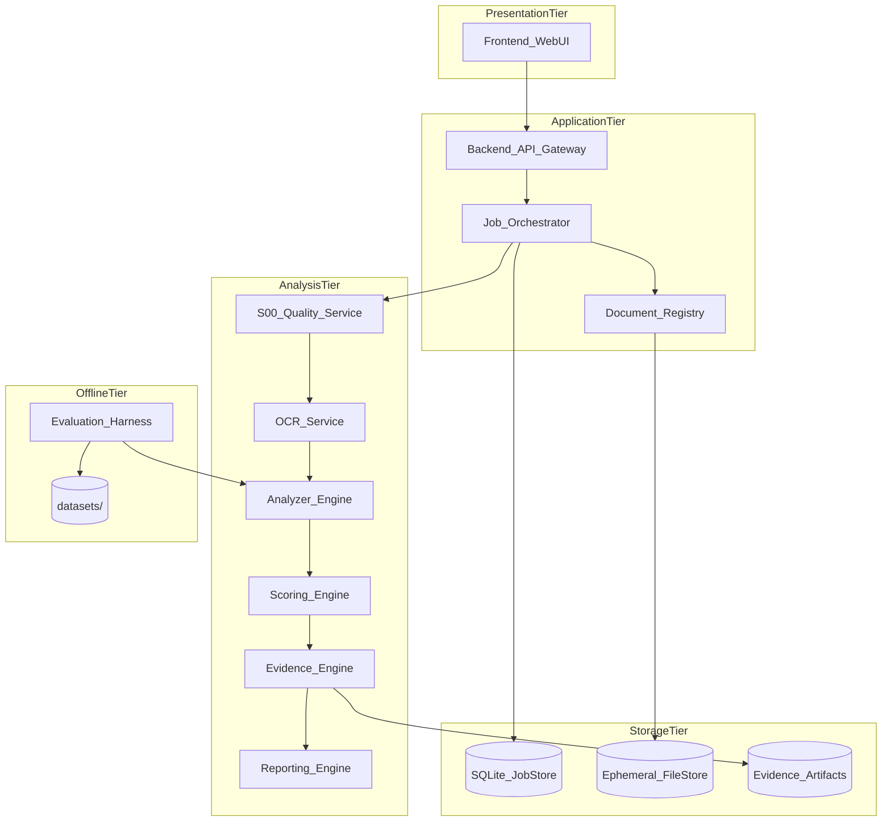
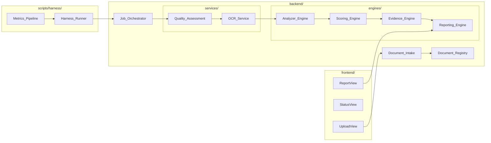
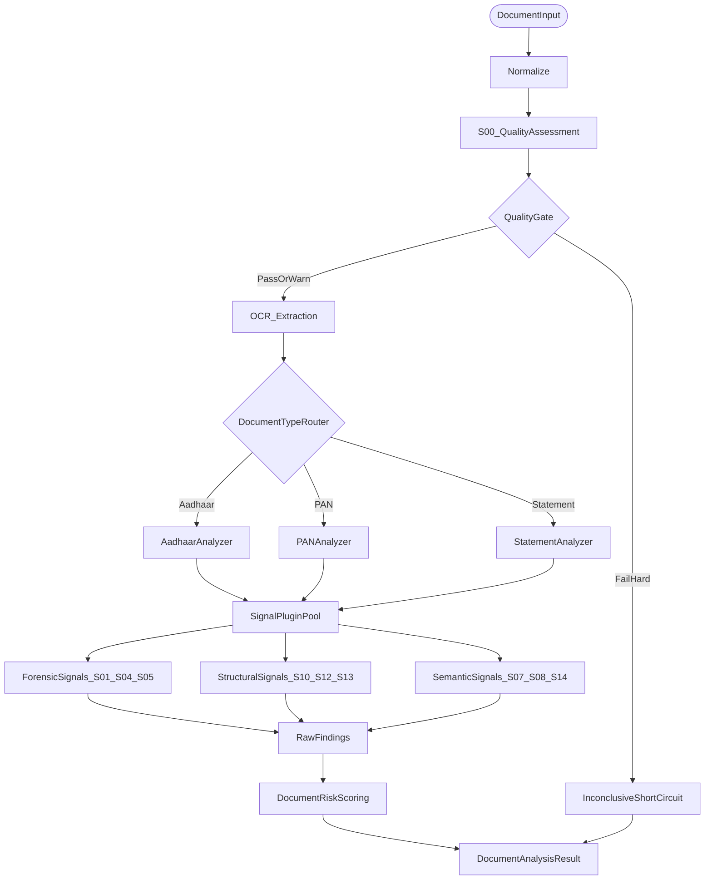
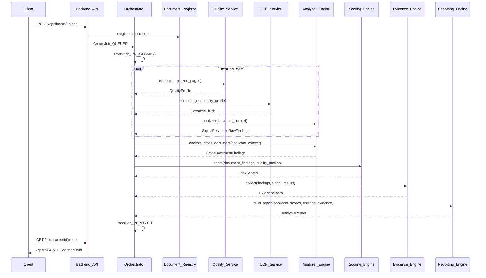
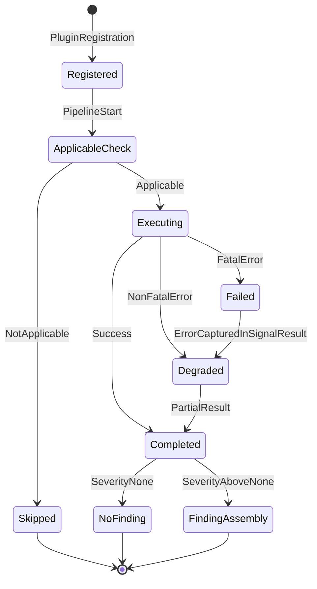
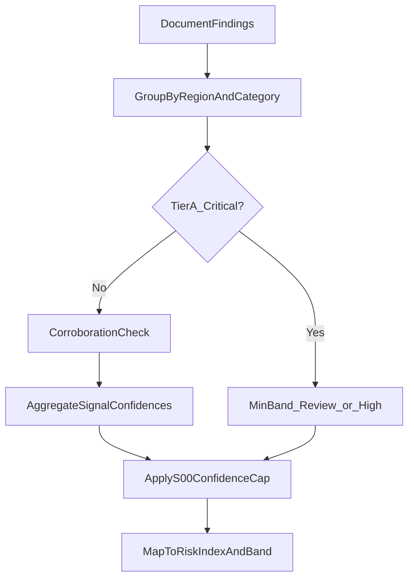
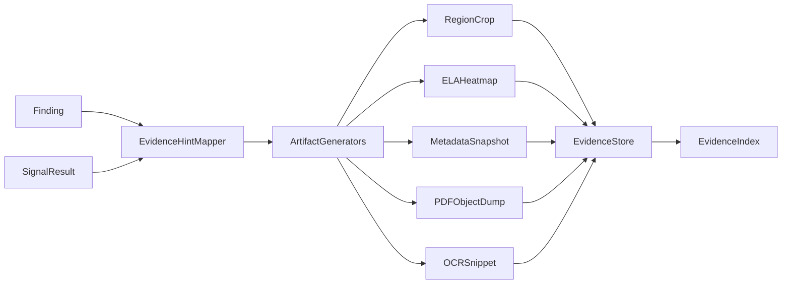
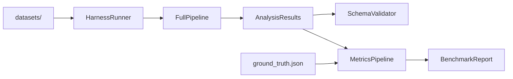
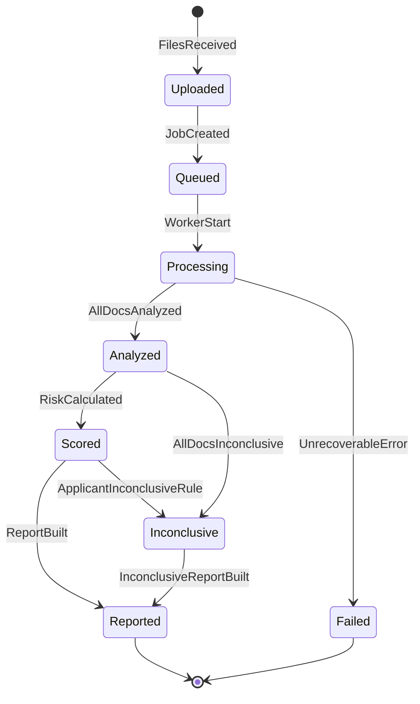

# KYCShield AI — Phase 1 Architecture & System Design

**Status:** FROZEN  
**Version:** 1.0.0  
**Date:** 2026-06-17  
**Prerequisite:** [PHASE_0_RESEARCH_AND_PLANNING.md](./PHASE_0_RESEARCH_AND_PLANNING.md) (signed off)

Phase 1 produces architecture, contracts, and design artifacts only. **No implementation code.**

---

## Table of Contents

1. [Executive Summary](#1-executive-summary)
2. [Architecture Overview](#2-architecture-overview)
3. [Component Architecture](#3-component-architecture)
4. [Data Flow Architecture](#4-data-flow-architecture)
5. [Service Boundaries](#5-service-boundaries)
6. [Analyzer Framework](#6-analyzer-framework)
7. [Signal Framework](#7-signal-framework)
8. [Data Models](#8-data-models)
9. [Risk Engine Design](#9-risk-engine-design)
10. [Evidence Engine Design](#10-evidence-engine-design)
11. [Repository Structure](#11-repository-structure)
12. [Evaluation Harness Design](#12-evaluation-harness-design)
13. [Technology Decisions](#13-technology-decisions)
14. [API Contracts](#14-api-contracts)
15. [State Machine](#15-state-machine)
16. [Risk Review](#16-risk-review)
17. [Final Recommendations](#17-final-recommendations)

---

## 1. Executive Summary

KYCShield AI Phase 1 freezes a **local-first, OSS-only, deterministic, explainable** architecture for pre-KYC forensic screening of Indian KYC documents (Aadhaar, PAN, Bank Statement — top 5 banks).

The system is decomposed into five runtime pillars plus an offline evaluation harness:

| Pillar | Role |
|---|---|
| **Frontend** | Applicant package upload, status polling, findings/evidence visualization |
| **Backend** | API gateway, job orchestration, persistence, service coordination |
| **Analyzer Engine** | Staged pipeline: S00 → OCR → Forensics → Structural validation |
| **Scoring Engine** | Evidence fusion, quality-gated confidence, document + applicant risk |
| **Evidence Engine** | Artifact collection, reference indexing, report assembly |
| **Evaluation Harness** | Labeled corpus, ground truth, metrics pipeline (offline) |

**Frozen pipeline order:**

```text
Upload → S00 Quality → OCR → Forensics → Structural Validation
       → Applicant Fusion → Risk Scoring → Evidence-backed Report
```

**Phase 1 deliverables:**

- Logical, component, data-flow, and pipeline architecture (this document)
- Service boundary definitions with I/O contracts
- Plugin-based Analyzer and Signal frameworks (interfaces only)
- Versioned JSON schemas (`docs/schemas/v1/`)
- Risk and Evidence engine methodology (no numeric weights)
- Repository layout, eval harness design, technology decisions, API contracts, state machine

Phase 2 may begin implementation immediately against these frozen artifacts.

---

## 2. Architecture Overview

### 2.1 Logical Architecture

Three logical tiers operate on a single host in MVP (local-first):



**Design principles:**

- **Deterministic:** Same input bytes + same `analyzer_version` → identical JSON output
- **Explainable:** Every finding traceable to signal(s) and evidence artifact(s)
- **Local-first:** No outbound network calls during analysis
- **Ephemeral PII:** File and evidence retention policy configurable; default minimal
- **Plugin extensibility:** Signals and document analyzers register without core modification

### 2.2 Deployment Unit (MVP)

Single process acceptable for MVP pilot:

- FastAPI application hosts API + orchestrator
- Analyzer/Scoring/Evidence as Python packages invoked in-process
- SQLite for job metadata
- Local filesystem for uploads and evidence (`backend/storage/`)

Future scaling (post-MVP): extract orchestrator queue (Redis/RQ) and worker pool — **not in Phase 1 scope**.

### 2.3 Trust Boundaries

| Boundary | Trust Level | Rule |
|---|---|---|
| Client upload | Untrusted | Validate MIME, size, page count; never execute PDF JS |
| Normalization | Semi-trusted | Sandboxed PDF parse; strip active content |
| Analysis pipeline | Trusted code | Read-only on normalized artifacts |
| Evidence output | Controlled disclosure | Redact full UID/PAN in UI by default; full values in secure export |

---

## 3. Component Architecture

### 3.1 Component Map



### 3.2 Component Responsibilities

| Component | Package Location | Responsibility |
|---|---|---|
| **Frontend** | `frontend/` | Upload applicant package; poll job status; render findings, evidence overlays, risk bands |
| **Document Intake** | `backend/services/intake/` | Multipart upload handling, validation, checksum, applicant job creation |
| **Document Registry** | `backend/services/registry/` | Canonical document records, normalized page index, file path resolution |
| **Job Orchestrator** | `backend/core/orchestrator/` | State machine enforcement, stage sequencing, failure handling |
| **Quality Assessment** | `backend/services/quality/` | S00 execution; produces `QualityProfile` |
| **OCR Service** | `backend/services/ocr/` | Field extraction; produces `ExtractedFields` |
| **Analyzer Engine** | `backend/engines/analyzer/` | Document-type routing, signal plugin execution, finding generation |
| **Scoring Engine** | `backend/engines/scoring/` | Document/applicant risk, corroboration, inconclusive logic |
| **Evidence Engine** | `backend/engines/evidence/` | Artifact persistence, reference IDs, traceability index |
| **Reporting Engine** | `backend/engines/reporting/` | JSON report assembly, HTML/PDF summary generation |
| **Evaluation Harness** | `scripts/harness/` | Batch runs against `datasets/`, metrics vs ground truth |

### 3.3 Analysis Pipeline Architecture



**Applicant-level continuation** (after all documents):


---

## 4. Data Flow Architecture

### 4.1 End-to-End Data Flow



### 4.2 Primary Data Artifacts (Pipeline Order)

| Stage | Input | Output | Stored |
|---|---|---|---|
| Intake | Raw bytes | `Document` record, file path | SQLite + FileStore |
| Normalize | Raw bytes | `DocumentPage[]`, metadata | FileStore |
| S00 | Pages | `QualityProfile` | Job record |
| OCR | Pages + Quality | `ExtractedFields` | Job record |
| Analyze | Context | `SignalResult[]`, `Finding[]` | Job record |
| Score | Findings + Quality | `RiskScore` (doc + applicant) | Job record |
| Evidence | Findings + overlays | `Evidence[]` | EvidenceStore |
| Report | All above | `AnalysisResult` | SQLite + JSON export |

### 4.3 Context Object Passed to Analyzers

The orchestrator assembles an immutable **`AnalysisContext`** per document:

```text
AnalysisContext
├── applicant_id
├── document_id
├── document_type          # aadhaar | pan | bank_statement
├── bank_id                # sbi | hdfc | icici | axis | kotak | null
├── source_format          # jpg | jpeg | png | pdf
├── normalized_pages[]     # DocumentPage refs
├── quality_profile        # QualityProfile
├── extracted_fields       # ExtractedFields (post-OCR)
├── file_metadata          # EXIF / PDF info
├── analyzer_version
└── ruleset_version
```

---

## 5. Service Boundaries

### 5.1 Document Intake Service

| Attribute | Definition |
|---|---|
| **Inputs** | Multipart upload (1–3 files), optional applicant reference ID, document type hints |
| **Outputs** | `applicant_id`, `job_id`, `document_ids[]`, validation errors |
| **Responsibilities** | MIME validation, size/page limits, virus-scan hook (future), checksum SHA-256, create applicant job |
| **Dependencies** | Document Registry, Job Orchestrator, config limits |
| **Must NOT** | Run OCR, forensics, or scoring |

**Validation rules (frozen):**

- Allowed MIME: `image/jpeg`, `image/png`, `application/pdf`
- Max file size: 10 MB per document (configurable)
- Max PDF pages: 20 per document (configurable)
- Required slots: aadhaar, pan, bank_statement (incomplete package allowed with flag)

### 5.2 Document Registry

| Attribute | Definition |
|---|---|
| **Inputs** | Registered file paths, document type, source format |
| **Outputs** | `Document`, `DocumentPage[]`, normalization manifest |
| **Responsibilities** | PDF→rasterization, page indexing, EXIF/PDF metadata extraction, immutable source preservation |
| **Dependencies** | PyMuPDF, Pillow, FileStore |
| **Must NOT** | Interpret fraud signals |

### 5.3 Quality Assessment Service (S00)

| Attribute | Definition |
|---|---|
| **Inputs** | `DocumentPage[]`, source format metadata |
| **Outputs** | `QualityProfile`, optional S00 informational findings |
| **Responsibilities** | Blur, resolution/DPI, rotation/skew, crop completeness, exposure scoring; quality gate decision |
| **Dependencies** | OpenCV, scikit-image (optional) |
| **Must NOT** | OCR or fraud classification |

**Quality gate outcomes:**

- `pass` — full pipeline proceeds
- `warn` — pipeline proceeds; Tier C confidence capped
- `fail` — document routed to `Inconclusive`; OCR/forensics skipped or minimal

### 5.4 OCR Service

| Attribute | Definition |
|---|---|
| **Inputs** | `DocumentPage[]`, `QualityProfile`, `document_type` |
| **Outputs** | `ExtractedFields` with per-field confidence |
| **Responsibilities** | Region-aware extraction per document type; Devanagari + English; field schema mapping |
| **Dependencies** | PaddleOCR (primary), document field schemas |
| **Must NOT** | Produce risk scores |

### 5.5 Analyzer Engine

| Attribute | Definition |
|---|---|
| **Inputs** | `AnalysisContext` |
| **Outputs** | `SignalResult[]`, `Finding[]` (document-level) |
| **Responsibilities** | Route to document analyzer; execute registered signal plugins; region segmentation coordination |
| **Dependencies** | Signal Registry, document analyzers, Quality + OCR outputs |
| **Must NOT** | Final applicant risk band assignment |

### 5.6 Scoring Engine

| Attribute | Definition |
|---|---|
| **Inputs** | Document findings, cross-doc findings, quality profiles, signal tiers |
| **Outputs** | `RiskScore` (per document + applicant), band assignment, confidence qualifier |
| **Responsibilities** | Corroboration, semantic anchors, quality caps, inconclusive logic |
| **Dependencies** | Ruleset config (bands/thresholds — no hardcoded weights in code structure) |
| **Must NOT** | Generate evidence artifacts |

### 5.7 Evidence Engine

| Attribute | Definition |
|---|---|
| **Inputs** | Findings, signal results, page images, overlay maps |
| **Outputs** | `Evidence[]`, evidence index (ID → path/URI) |
| **Responsibilities** | Crop regions, ELA heatmaps, metadata snapshots, PDF object refs; immutability per job |
| **Dependencies** | FileStore, EvidenceStore |
| **Must NOT** | Alter findings or scores |

### 5.8 Reporting Engine

| Attribute | Definition |
|---|---|
| **Inputs** | `AnalysisResult` (complete) |
| **Outputs** | JSON report, HTML summary (optional PDF export Phase 9) |
| **Responsibilities** | Schema-valid assembly, redaction policy, human-readable narrative blocks |
| **Dependencies** | Evidence index, JSON schemas |
| **Must NOT** | Re-run analysis |

---

## 6. Analyzer Framework

### 6.1 Design Pattern

**Strategy + Plugin Registry:**

- One **Document Analyzer** per document type (strategy)
- Many **Signal Plugins** per analyzer (composed pipeline)
- **Cross-Document Analyzer** at applicant scope (S14)

### 6.2 Interface Definitions (Contract Only)

```python
# backend/engines/analyzer/interfaces.py — CONTRACT ONLY (Phase 2 implements)

from abc import ABC, abstractmethod
from typing import Protocol


class SignalPlugin(Protocol):
    signal_id: str          # e.g. "S01"
    signal_tier: str        # A | B | C | D
    document_types: list[str]
    priority: int           # execution order within stage

    def applicable(self, ctx: "AnalysisContext") -> bool: ...
    def execute(self, ctx: "AnalysisContext") -> "SignalResult": ...


class BaseAnalyzer(ABC):
    document_type: str

    @abstractmethod
    def get_signal_pipeline(self) -> list[SignalPlugin]: ...

    @abstractmethod
    def analyze(self, ctx: "AnalysisContext") -> "DocumentAnalysisResult": ...


class DocumentAnalyzer(BaseAnalyzer):
    """Orchestrates S00-gated signal execution for one document."""

    def analyze(self, ctx: "AnalysisContext") -> "DocumentAnalysisResult":
        # 1. Check quality gate
        # 2. Run applicable plugins in priority order
        # 3. Delegate finding assembly to FindingAssembler
        ...


class CrossDocumentAnalyzer(ABC):
    @abstractmethod
    def analyze(self, ctx: "ApplicantAnalysisContext") -> list["CrossDocumentFinding"]: ...


class RiskEvaluator(Protocol):
    """Used by Scoring Engine — not implemented in Analyzer."""

    def evaluate_document(self, findings: list, quality: "QualityProfile") -> "RiskScore": ...
    def evaluate_applicant(self, doc_scores: list, cross_findings: list) -> "RiskScore": ...


class EvidenceGenerator(Protocol):
    """Called by Evidence Engine after findings exist."""

    def generate(self, finding: "Finding", ctx: "AnalysisContext") -> list["Evidence"]: ...


class FindingAssembler(Protocol):
    def from_signal_results(
        self, results: list["SignalResult"], ctx: "AnalysisContext"
    ) -> list["Finding"]: ...
```

### 6.3 Document Analyzer Specializations

| Analyzer | `document_type` | Bank Dispatch | Signal Subset |
|---|---|---|---|
| **AadhaarAnalyzer** | `aadhaar` | N/A | S01, S04, S05, S07, S08, S10, S11, S13 |
| **PANAnalyzer** | `pan` | N/A | S01, S04, S05, S07, S10, S11, S13 |
| **StatementAnalyzer** | `bank_statement` | `sbi\|hdfc\|icici\|axis\|kotak` | S01, S04, S05, S06, S07, S10, S11, S12, S13 |

**StatementAnalyzer bank dispatch:**

```text
detect_bank(ctx) → bank_id | unsupported
  if unsupported → single Finding + Inconclusive (no parser invocation)
  else → BankTemplateStrategy[bank_id]
```

### 6.4 Signal Plugin Registration

```python
# Registration pattern (Phase 2)
SignalRegistry.register(S01_ELAPlugin())
SignalRegistry.register(S04_EXIFPlugin())
# ...

DocumentAnalyzerRegistry.register(AadhaarAnalyzer())
DocumentAnalyzerRegistry.register(PANAnalyzer())
DocumentAnalyzerRegistry.register(StatementAnalyzer())
```

### 6.5 Extensibility Strategy

| Extension | Mechanism |
|---|---|
| New signal (e.g. S02) | Implement `SignalPlugin`; register; add to analyzer pipeline config |
| New bank (post-MVP) | Add `BankTemplateStrategy` + template assets; register in StatementAnalyzer |
| New document type (post-MVP) | New `BaseAnalyzer` subclass + field schema + registry entry |
| Ruleset tuning | `config/rulesets/v1/` YAML — thresholds, bands, quality caps |
| Analyzer version bump | Semver on package; recorded in every `AnalysisResult` |

**Extension rules:**

- Plugins must be stateless (determinism)
- Plugins must not call external network
- Plugins must return `SignalResult` even on internal error (degraded, not crash)

---

## 7. Signal Framework

### 7.1 Signal Registry (MVP P0)

| ID | Name | Tier | Category | Doc Types | Stage |
|---|---|---|---|---|---|
| S00 | Document Quality Assessment | — | QualityGate | all | pre-OCR |
| S01 | Error Level Analysis | C | VisualForgery | all | forensic |
| S04 | EXIF/Metadata Audit | D | MetadataManipulation | images | forensic |
| S05 | PDF Structure Forensics | B | MetadataManipulation | pdf | forensic |
| S06 | PDF Metadata Cross-check | D | MetadataManipulation | pdf | structural |
| S07 | OCR Field Validation | A | ContentManipulation | all | semantic |
| S08 | OCR vs QR/Barcode | A | ContentManipulation | aadhaar | semantic |
| S10 | Layout/Template Matching | B | LayoutManipulation | all | structural |
| S11 | Region Segmentation | — | Infrastructure | all | pre-forensic |
| S12 | Arithmetic Consistency | A | ContentManipulation | bank_statement | semantic |
| S13 | Cross-field Logical Rules | A | ContentManipulation | all | semantic |
| S14 | Cross-document Consistency | A | ContentManipulation | applicant | applicant |

### 7.2 Signal Categories

| Category | Enum Value | Maps to Phase 0 Taxonomy |
|---|---|---|
| QualityGate | `quality_gate` | (precondition — not fraud) |
| VisualForegery | `visual_forgery` | Visual Forgery |
| MetadataManipulation | `metadata_manipulation` | Metadata Manipulation |
| ContentManipulation | `content_manipulation` | Content Manipulation |
| LayoutManipulation | `layout_manipulation` | Layout Manipulation |
| SyntheticGeneration | `synthetic_generation` | Synthetic Generation |
| Infrastructure | `infrastructure` | Segmentation, routing |

### 7.3 Signal Severity Levels

Used inside `SignalResult` — distinct from Finding severity (finding may fuse multiple signals):

| Level | Meaning |
|---|---|
| `none` | Signal ran; no anomaly |
| `informational` | Notable but not indicative of tampering |
| `low` | Weak anomaly |
| `medium` | Moderate anomaly |
| `high` | Strong anomaly |
| `critical` | Definitive integrity violation (semantic) |

### 7.4 Signal Lifecycle



### 7.5 Signal Contract

Every plugin returns **`SignalResult`** (see [schemas/v1/signal_result.schema.json](./schemas/v1/signal_result.schema.json)):

Required fields:

- `schema_version`, `signal_id`, `signal_version`
- `status`: `completed | degraded | skipped | failed`
- `severity`: signal severity level
- `confidence`: 0.0–1.0 (signal-local, pre-fusion)
- `tier`: A | B | C | D
- `observations[]`: structured facts (machine-readable)
- `regions[]`: optional bboxes
- `evidence_hints[]`: requested evidence types for Evidence Engine
- `quality_sensitive`: bool — if true, subject to S00 confidence cap
- `limitations`: string
- `duration_ms`: int

### 7.6 Signal Execution Ordering

```text
Stage 0 (Quality):     S00
Stage 1 (Segment):     S11
Stage 2 (Forensic):    S01, S04, S05        — parallelizable
Stage 3 (Structural):  S06, S10             — parallelizable
Stage 4 (Semantic):    S07, S08, S12, S13  — sequential deps on OCR
Stage 5 (Applicant):   S14                  — after all documents
```

---

## 8. Data Models

All schemas are versioned under `docs/schemas/v1/`. Root field: `"schema_version": "1.0.0"`.

### 8.1 Schema Index

| Schema | File | Purpose |
|---|---|---|
| Applicant | `applicant.schema.json` | Applicant package container |
| Document | `document.schema.json` | Single uploaded document |
| DocumentPage | `document_page.schema.json` | Normalized page/image unit |
| QualityProfile | `quality_profile.schema.json` | S00 output |
| ExtractedFields | `extracted_fields.schema.json` | OCR output (embedded in analysis) |
| SignalResult | `signal_result.schema.json` | Per-signal output |
| Finding | `finding.schema.json` | Human-facing anomaly record |
| CrossDocumentFinding | `cross_document_finding.schema.json` | Applicant-level finding |
| Evidence | `evidence.schema.json` | Artifact reference |
| RiskScore | `risk_score.schema.json` | Document or applicant score |
| AnalysisResult | `analysis_result.schema.json` | Complete job output |
| Error | `error.schema.json` | API and pipeline errors |

### 8.2 Applicant

```json
{
  "schema_version": "1.0.0",
  "applicant_id": "uuid",
  "external_reference": "optional-client-id",
  "job_id": "uuid",
  "status": "uploaded | queued | processing | analyzed | scored | reported | failed | inconclusive",
  "documents": ["document_id"],
  "completeness": {
    "aadhaar": true,
    "pan": true,
    "bank_statement": true,
    "missing": []
  },
  "created_at": "ISO-8601",
  "updated_at": "ISO-8601"
}
```

### 8.3 Document

```json
{
  "schema_version": "1.0.0",
  "document_id": "uuid",
  "applicant_id": "uuid",
  "document_type": "aadhaar | pan | bank_statement",
  "bank_id": "sbi | hdfc | icici | axis | kotak | null",
  "source_format": "jpg | jpeg | png | pdf",
  "source_checksum_sha256": "hex",
  "page_count": 1,
  "pages": ["page_id"],
  "file_metadata": {},
  "created_at": "ISO-8601"
}
```

### 8.4 DocumentPage

```json
{
  "schema_version": "1.0.0",
  "page_id": "uuid",
  "document_id": "uuid",
  "page_index": 0,
  "width_px": 2480,
  "height_px": 3508,
  "dpi_estimate": 300,
  "storage_ref": "relative/path/to/normalized.png",
  "derived_from_pdf": false
}
```

### 8.5 QualityProfile

```json
{
  "schema_version": "1.0.0",
  "document_id": "uuid",
  "overall_gate": "pass | warn | fail",
  "overall_score": 0.0,
  "metrics": {
    "blur": { "score": 0.0, "gate": "pass | warn | fail" },
    "resolution": { "score": 0.0, "gate": "pass | warn | fail", "width_px": 0, "height_px": 0 },
    "rotation": { "score": 0.0, "gate": "pass | warn | fail", "skew_degrees": 0.0 },
    "crop_completeness": { "score": 0.0, "gate": "pass | warn | fail" },
    "exposure": { "overexposure": 0.0, "underexposure": 0.0, "gate": "pass | warn | fail" }
  },
  "confidence_cap_tier_c": 1.0,
  "limitations": "string",
  "signal_id": "S00"
}
```

### 8.6 Finding

```json
{
  "schema_version": "1.0.0",
  "finding_id": "uuid",
  "document_id": "uuid",
  "document_type": "aadhaar | pan | bank_statement",
  "category": "visual_forgery | metadata_manipulation | content_manipulation | layout_manipulation | synthetic_generation | quality_gate",
  "title": "short title",
  "description": "ops-readable explanation",
  "severity": "informational | low | medium | high | critical",
  "confidence": 0.0,
  "confidence_qualifier": "high | medium | low",
  "signals_triggered": ["S01", "S07"],
  "regions": [{ "page_index": 0, "bbox": [0, 0, 100, 100], "field_name": "uid" }],
  "evidence_refs": ["evidence_id"],
  "limitations": "may be affected by WhatsApp compression",
  "benign_alternatives": ["recompression artifact"]
}
```

### 8.7 CrossDocumentFinding

Extends Finding semantics at applicant scope — no `document_id`; adds `documents_involved[]` and `consistency_field` (name, dob, pan).

### 8.8 Evidence

```json
{
  "schema_version": "1.0.0",
  "evidence_id": "uuid",
  "finding_id": "uuid",
  "evidence_type": "crop | ela_heatmap | metadata_snapshot | pdf_object_ref | ocr_snippet | overlay",
  "mime_type": "image/png | application/json | text/plain",
  "storage_ref": "jobs/{job_id}/evidence/{evidence_id}.png",
  "description": "ELA heatmap of photo region",
  "related_regions": [{ "page_index": 0, "bbox": [] }],
  "created_at": "ISO-8601"
}
```

### 8.9 RiskScore

```json
{
  "schema_version": "1.0.0",
  "scope": "document | applicant",
  "scope_id": "uuid",
  "risk_index": 0,
  "band": "low | review | high | inconclusive",
  "confidence_qualifier": "high | medium | low",
  "contributing_findings": ["finding_id"],
  "quality_constrained": false,
  "inconclusive_reason": "optional string",
  "methodology_version": "1.0.0"
}
```

### 8.10 AnalysisResult

Top-level job output — aggregates all artifacts:

```json
{
  "schema_version": "1.0.0",
  "analysis_id": "uuid",
  "applicant_id": "uuid",
  "job_id": "uuid",
  "status": "reported | failed | inconclusive",
  "analyzer_version": "1.0.0",
  "ruleset_version": "1.0.0",
  "documents": [{}],
  "quality_profiles": [{}],
  "extracted_fields": {},
  "signal_results": [{}],
  "findings": [{}],
  "cross_document_findings": [{}],
  "document_risk_scores": [{}],
  "applicant_risk_score": {},
  "evidence_index": {},
  "timing": { "total_ms": 0, "per_stage_ms": {} },
  "created_at": "ISO-8601"
}
```

Full JSON Schema definitions: [`docs/schemas/v1/`](./schemas/v1/).

---

## 9. Risk Engine Design

### 9.1 Design Goals

- No single signal → `High` band alone (except Tier A critical semantic violations)
- S00 quality profile modulates Tier C confidence
- Corroboration across independent signal families elevates confidence
- `Inconclusive` is a first-class outcome, not a failure
- No fixed numeric weights in Phase 1 — methodology only; weights live in `config/rulesets/v1/scoring.yaml` (Phase 2)

### 9.2 Document Risk Calculation (Methodology)



**Steps:**

1. **Filter** informational-only findings (exclude from risk index; include in report)
2. **Detect semantic anchors:** S08 mismatch, S07 checksum fail, S12 balance error → minimum band `Review`; multiple anchors → `High`
3. **Corroboration:** Same region + ≥2 signal tiers {B,C,D} → multiply confidence factor (configurable in ruleset)
4. **Aggregate:** Convert finding severities + confidences → raw `risk_index` 0–100 (monotonic, not linear sum)
5. **Quality cap:** If `quality_profile.overall_gate = warn`, cap Tier C contribution; if `fail`, force `Inconclusive`
6. **Band mapping:** `low` [0–30], `review` [31–70], `high` [71–100] — thresholds in ruleset YAML

### 9.3 Applicant Risk Calculation (Methodology)

```text
applicant_risk_index = max(
    weighted_max(document_risk_indices),
    cross_document_finding_boost
)
```

**Rules (frozen logic, configurable magnitudes):**

- `max(doc_scores) ≥ High` → applicant band ≥ `Review`
- Any `cross_document_finding` severity ≥ `medium` → applicant band ≥ `Review`
- Incomplete package → separate `completeness` flag; does NOT reduce risk automatically
- All documents `Inconclusive` → applicant `Inconclusive`

### 9.4 Confidence Calculation

**Finding confidence** = f(signal confidences, corroboration, quality cap)

**Score confidence qualifier:**

| Qualifier | Condition |
|---|---|
| `high` | Tier A anchor present OR ≥2 corroborating families on same region; quality gate pass |
| `medium` | Single Tier B/C finding; or warn quality gate |
| `low` | Tier C/D only; or partial OCR; or degraded signal status |

### 9.5 Corroboration Strategy

**Independent families:**

- Visual (S01)
- Metadata (S04, S05, S06)
- Semantic (S07, S08, S12, S13)
- Layout (S10)

Corroboration requires **same region overlap ≥ IoU threshold** (config default 0.3) AND **different families**.

### 9.6 Inconclusive Logic

| Trigger | Scope |
|---|---|
| S00 `fail` | Document → Inconclusive |
| Unsupported bank | Document → Inconclusive |
| OCR confidence below minimum | Document → findings suppressed; may → Inconclusive |
| Statement parse failure | Document → Inconclusive with explicit finding |
| Pipeline exception | Job → Failed (not Inconclusive) |
| All docs inconclusive | Applicant → Inconclusive |

**Never:** map quality failure to `Low` risk (false reassurance).

### 9.7 Quality-Based Confidence Reduction

```text
effective_confidence = min(signal_confidence, quality_profile.confidence_cap_tier_c)
```

When `overall_gate = warn`, `confidence_cap_tier_c` defaults to 0.5 (ruleset). Tier A signals exempt from cap.

---

## 10. Evidence Engine Design

### 10.1 Evidence Collection Flow



### 10.2 Evidence Types

| Type | Source Signals | Format |
|---|---|---|
| `crop` | All region-based | PNG |
| `ela_heatmap` | S01 | PNG overlay |
| `metadata_snapshot` | S04, S05, S06 | JSON |
| `pdf_object_ref` | S05 | JSON (object id, font, bbox) |
| `ocr_snippet` | S07, S08 | JSON + text |
| `overlay` | S11, S10 | PNG (bbox drawn) |
| `comparison_side_by_side` | S08 | PNG (QR decode vs OCR) |

### 10.3 Evidence Storage Layout

```text
backend/storage/jobs/{job_id}/
├── source/           # immutable uploads
├── normalized/       # page images
└── evidence/         # generated artifacts
    ├── {evidence_id}.png
    └── {evidence_id}.json
```

**Retention:** Default delete job workspace after 24h (configurable). Evidence refs in SQLite may outlive files — report must handle missing artifact gracefully.

### 10.4 Evidence References

Findings carry `evidence_refs[]` — UUIDs only. Report resolves via `evidence_index`:

```json
{
  "evidence_id": {
    "storage_ref": "...",
    "mime_type": "...",
    "evidence_type": "..."
  }
}
```

### 10.5 Heatmap References

ELA heatmaps stored as PNG with linked `related_regions`. Frontend overlays heatmap at 50% opacity on normalized page.

### 10.6 Finding Traceability

Every finding MUST trace:

```text
Finding → signals_triggered[] → SignalResult.observations[] → Evidence[]
```

Stored in report as optional `trace` block for audit (Phase 2).

### 10.7 Explainability Requirements (Evidence Engine)

- Auto-generate crops for every region-based finding severity ≥ `medium`
- Metadata snapshots must redact unrelated PII fields
- Include `description` human string per evidence item
- No evidence artifact without parent finding (except S00 quality informational)

---

## 11. Repository Structure

```text
KYCShield AI/
├── frontend/
│   ├── public/
│   ├── src/
│   │   ├── api/                 # API client (typed from OpenAPI)
│   │   ├── components/          # Upload, Status, Report, FindingCard, EvidenceViewer
│   │   ├── pages/               # UploadPage, ReportPage
│   │   ├── types/               # TS types mirroring JSON schemas
│   │   └── App.tsx
│   ├── package.json
│   └── vite.config.ts
│
├── backend/
│   ├── app/
│   │   ├── main.py              # FastAPI entry
│   │   ├── api/
│   │   │   ├── routes/          # upload, analyze, status, report, result
│   │   │   └── dependencies.py
│   │   ├── core/
│   │   │   ├── orchestrator/    # job state machine, stage runner
│   │   │   ├── config.py
│   │   │   └── exceptions.py
│   │   ├── models/              # Pydantic models from JSON schemas
│   │   ├── db/                  # SQLite models, session
│   │   └── services/
│   │       ├── intake/
│   │       ├── registry/
│   │       ├── quality/         # S00
│   │       └── ocr/
│   ├── engines/
│   │   ├── analyzer/
│   │   │   ├── interfaces.py
│   │   │   ├── registry.py
│   │   │   ├── aadhaar/
│   │   │   ├── pan/
│   │   │   ├── statement/
│   │   │   │   ├── sbi/
│   │   │   │   ├── hdfc/
│   │   │   │   ├── icici/
│   │   │   │   ├── axis/
│   │   │   │   └── kotak/
│   │   │   └── cross_document/
│   │   ├── scoring/
│   │   │   ├── evaluator.py
│   │   │   └── corroboration.py
│   │   ├── evidence/
│   │   │   ├── collectors/
│   │   │   └── store.py
│   │   └── reporting/
│   │       ├── json_builder.py
│   │       └── html_builder.py
│   ├── signals/
│   │   ├── base.py
│   │   ├── s00_quality/
│   │   ├── s01_ela/
│   │   ├── s04_exif/
│   │   └── ...                  # one folder per signal
│   ├── config/
│   │   ├── limits.yaml
│   │   └── rulesets/v1/
│   │       ├── scoring.yaml
│   │       ├── quality_gates.yaml
│   │       └── bands.yaml
│   ├── storage/                 # gitignored runtime data
│   ├── templates/               # bank/card layout references
│   ├── tests/
│   ├── pyproject.toml
│   └── requirements.txt
│
├── datasets/
│   ├── README.md                # corpus usage, ethics, no real PII
│   ├── clean/
│   │   ├── aadhaar/
│   │   ├── pan/
│   │   └── bank_statement/{sbi,hdfc,icici,axis,kotak}/
│   ├── tampered/
│   │   ├── aadhaar/
│   │   ├── pan/
│   │   └── bank_statement/
│   ├── synthetic/
│   │   ├── aadhaar/
│   │   ├── pan/
│   │   └── bank_statement/
│   ├── cross_doc_mismatch/
│   │   └── packages/            # subdirs per applicant package
│   ├── quality_failures/
│   │   ├── blur/
│   │   ├── low_resolution/
│   │   ├── overexposed/
│   │   └── whatsapp_recompressed/
│   └── ground_truth.schema.json
│
├── docs/
│   ├── PHASE_0_RESEARCH_AND_PLANNING.md
│   ├── PHASE_1_ARCHITECTURE_AND_SYSTEM_DESIGN.md  # this document
│   ├── schemas/v1/              # JSON Schema contracts
│   └── adr/                     # architecture decision records
│
├── scripts/
│   ├── harness/
│   │   ├── run_benchmark.py     # Phase 2+
│   │   ├── compute_metrics.py
│   │   └── validate_schemas.py
│   └── seed/                    # dev fixtures (synthetic only)
│
└── tests/
    ├── contract/                # schema validation tests
    ├── integration/             # pipeline integration (Phase 2+)
    └── fixtures/
```

### Folder Responsibilities Summary

| Path | Responsibility |
|---|---|
| `frontend/` | Minimal pilot UI; consumes API; displays evidence |
| `backend/app/` | HTTP layer, orchestration, persistence |
| `backend/engines/` | Core analysis, scoring, evidence, reporting logic |
| `backend/signals/` | Isolated signal plugin implementations |
| `backend/config/rulesets/` | Externalized thresholds (no magic numbers in code) |
| `backend/templates/` | Reference layouts for S10 and bank parsers |
| `datasets/` | Offline eval corpus only — never committed real PII |
| `docs/schemas/` | Frozen contracts |
| `scripts/harness/` | Benchmark and metrics tooling |
| `tests/contract/` | Ensures outputs validate against schemas |

---

## 12. Evaluation Harness Design

### 12.1 Dataset Architecture

```text
datasets/
├── clean/                    # Legitimate documents (synthetic or licensed)
├── tampered/                 # Known edit type + region labeled
├── synthetic/                # AI/template-generated fakes
├── cross_doc_mismatch/       # Multi-doc packages with intentional inconsistency
└── quality_failures/         # S00 stress cases (blur, WhatsApp, etc.)
```

Each sample directory:

```text
datasets/tampered/aadhaar/sample_001/
├── aadhaar.pdf               # or .jpg
└── metadata.json             # sample metadata (see below)
```

Package layout (`cross_doc_mismatch`):

```text
datasets/cross_doc_mismatch/packages/pkg_001/
├── aadhaar.jpg
├── pan.jpg
├── statement.pdf
├── metadata.json
└── ground_truth.json
```

### 12.2 Sample metadata.json

```json
{
  "sample_id": "tampered_aadhaar_001",
  "document_type": "aadhaar",
  "source_format": "jpg",
  "category": "clean | tampered | synthetic | quality_failure",
  "taxonomy": "content_manipulation",
  "edit_description": "UID field overlay",
  "edit_tool": "photoshop",
  "bank_id": null,
  "quality_notes": "whatsapp_forwarded",
  "consent": "synthetic_generated",
  "created_at": "ISO-8601"
}
```

### 12.3 ground_truth.json

```json
{
  "schema_version": "1.0.0",
  "sample_id": "tampered_aadhaar_001",
  "expected_band": "review | high | low | inconclusive",
  "expected_findings": [
    {
      "category": "content_manipulation",
      "severity_min": "medium",
      "region": { "page_index": 0, "bbox": [100, 200, 300, 250], "field_name": "uid" },
      "signals_expected": ["S07", "S01"]
    }
  ],
  "expected_signals": {
    "S07": { "severity_min": "high" },
    "S01": { "severity_min": "medium" }
  },
  "quality_gate_expected": "pass | warn | fail",
  "notes": ""
}
```

Full schema: [`datasets/ground_truth.schema.json`](../datasets/ground_truth.schema.json).

### 12.4 Evaluation Process



1. Discover samples recursively
2. Run pipeline in batch mode (no HTTP required)
3. Validate every output against `analysis_result.schema.json`
4. Compare to ground truth
5. Emit benchmark report JSON + markdown summary

### 12.5 Metrics Pipeline (Phase 0 M1–M9)

| Metric | Computation |
|---|---|
| M1 Region detection | IoU ≥ 0.3 between expected bbox and finding regions |
| M2 Clean pass rate | `expected_band=low` samples score Low |
| M3 Critical semantic | QR/checksum tampered samples flagged Critical/High |
| M4 Evidence completeness | Schema + every finding has evidence_refs |
| M5 Cross-doc | Mismatch packages → Review+ |
| M6 Statement arithmetic | Tampered balance rows detected when parse succeeds |
| M7 Latency | p95 total_ms from AnalysisResult.timing |
| M8 Explainability | Manual rubric (outside automated harness) |
| M9 Determinism | Double-run byte-identical JSON diff |

### 12.6 Benchmark Process

- **Smoke benchmark:** 5 samples per category — run on every PR (Phase 2+)
- **Full benchmark:** Entire corpus — weekly / pre-release
- **Hardware profile:** Document CPU model + RAM in benchmark report for M7 comparability
- **Version pinning:** Record `analyzer_version`, `ruleset_version`, git SHA in report

---

## 13. Technology Decisions

### 13.1 Decision Matrix

#### FastAPI vs Flask

| | FastAPI | Flask |
|---|---|---|
| **Pros** | Native async; automatic OpenAPI; Pydantic integration; modern typing | Minimal; large ecosystem; simpler mental model |
| **Cons** | Heavier abstraction | Manual OpenAPI; less native validation |
| **Recommendation** | **FastAPI** | — |
| **Decision** | **FastAPI** — schema-first API aligns with frozen JSON contracts; OpenAPI drives frontend types |

#### PaddleOCR vs Tesseract

| | PaddleOCR | Tesseract |
|---|---|---|
| **Pros** | Strong Devanagari; layout-aware; better on noisy phone photos | Mature; lighter; easy deploy; English strong |
| **Cons** | Heavier deps; model download | Weak Devanagari; layout naive |
| **Recommendation** | **PaddleOCR primary** | Tesseract optional fallback for English-only fast path |
| **Decision** | **PaddleOCR** — Indian KYC requires Devanagari; OCR errors drive false tampering flags if weak |

#### SQLite vs PostgreSQL

| | SQLite | PostgreSQL |
|---|---|---|
| **Pros** | Zero config; local-first; embedded | Concurrent writes; production scale |
| **Cons** | Single-writer; not ideal for multi-tenant scale | Ops overhead; overkill for MVP |
| **Recommendation** | **SQLite for MVP** | Postgres interface via SQLAlchemy for future swap |
| **Decision** | **SQLite** — job metadata only; files on disk; matches local-first constraint |

#### PyMuPDF vs pdfplumber

| | PyMuPDF | pdfplumber |
|---|---|---|
| **Pros** | Fast rasterize; object-level access; robust | Excellent table extraction; text bbox precision |
| **Cons** | Table extraction weaker | Slower; heavier on complex PDFs |
| **Recommendation** | **PyMuPDF primary** | pdfplumber for statement table stage |
| **Decision** | **Both** — PyMuPDF for normalize + S05; pdfplumber for S12 statement parsing |

#### OpenCV vs Alternatives

| | OpenCV | Pillow / scikit-image |
|---|---|---|
| **Pros** | Industry standard; blur, warp, ELA-friendly; fast | Simpler API; enough for basic ops |
| **Cons** | Large binary dep | Less comprehensive CV |
| **Recommendation** | **OpenCV** | Pillow for basic I/O alongside |
| **Decision** | **OpenCV** for S00 + S01 + deskew; **Pillow** for ELA generation and image I/O |

### 13.2 Frozen Technology Stack

| Layer | Choice |
|---|---|
| Backend framework | FastAPI |
| Validation / models | Pydantic v2 |
| Database | SQLite + SQLAlchemy |
| OCR | PaddleOCR |
| PDF | PyMuPDF (primary) + pdfplumber (tables) |
| Image / CV | OpenCV + Pillow |
| QR | pyzbar |
| EXIF | exifread |
| Frontend | React + Vite + TypeScript |
| API docs | OpenAPI 3.1 (auto from FastAPI) |
| Schema validation | jsonschema |

### 13.3 Explicitly Excluded

Cloud APIs, GPU-required deep learning, face recognition, government verification SDKs.

---

## 14. API Contracts

Base path: `/api/v1`. All responses include `schema_version: "1.0.0"`.

### 14.1 Upload API

**`POST /api/v1/applicants/upload`**

Content-Type: `multipart/form-data`

| Field | Type | Required |
|---|---|---|
| `aadhaar` | file | no |
| `pan` | file | no |
| `bank_statement` | file | no |
| `external_reference` | string | no |

Response `201`:

```json
{
  "schema_version": "1.0.0",
  "applicant_id": "uuid",
  "job_id": "uuid",
  "document_ids": { "aadhaar": "uuid", "pan": "uuid", "bank_statement": "uuid" },
  "status": "queued",
  "completeness": { "aadhaar": true, "pan": false, "bank_statement": true, "missing": ["pan"] }
}
```

Triggers async analysis (or sync for harness mode via header `X-Sync-Mode: true`).

### 14.2 Analyze API

**`POST /api/v1/applicants/{applicant_id}/analyze`**

Re-run analysis on existing uploads (idempotent new job).

Request: empty body or `{ "ruleset_version": "1.0.0" }`

Response `202`:

```json
{
  "schema_version": "1.0.0",
  "job_id": "uuid",
  "status": "queued"
}
```

### 14.3 Status API

**`GET /api/v1/jobs/{job_id}/status`**

Response `200`:

```json
{
  "schema_version": "1.0.0",
  "job_id": "uuid",
  "applicant_id": "uuid",
  "status": "processing",
  "stage": "ocr | quality | forensic | scoring | reporting",
  "progress_pct": 45,
  "updated_at": "ISO-8601",
  "error": null
}
```

### 14.4 Report API

**`GET /api/v1/applicants/{applicant_id}/report`**

Query: `?format=json|html` (default json)

Response `200`: Full `AnalysisResult` (JSON) or HTML string.

Response `409` if job not in `reported` state.

### 14.5 Result API

**`GET /api/v1/jobs/{job_id}/result`**

Lightweight result for polling — risk bands + finding counts without full evidence payloads.

```json
{
  "schema_version": "1.0.0",
  "job_id": "uuid",
  "status": "reported",
  "applicant_risk_score": { "band": "review", "risk_index": 52, "confidence_qualifier": "medium" },
  "document_summaries": [
    { "document_type": "aadhaar", "band": "low", "finding_count": 1, "critical_count": 0 }
  ],
  "report_url": "/api/v1/applicants/{id}/report"
}
```

### 14.6 Error Schema

```json
{
  "schema_version": "1.0.0",
  "error_code": "VALIDATION_ERROR | UNSUPPORTED_FORMAT | JOB_NOT_FOUND | PIPELINE_FAILED",
  "message": "human-readable",
  "details": {},
  "request_id": "uuid"
}
```

HTTP mapping: 400 validation, 404 not found, 413 payload too large, 422 unsupported doc/bank, 500 pipeline failure.

---

## 15. State Machine

### 15.1 Job / Applicant States



### 15.2 State Definitions

| State | Meaning |
|---|---|
| `uploaded` | Files stored; job not yet queued |
| `queued` | Awaiting processing |
| `processing` | Pipeline running (sub-stages in status API) |
| `analyzed` | Findings produced; scoring pending or done |
| `scored` | Risk bands assigned |
| `reported` | AnalysisResult persisted and available |
| `failed` | Unrecoverable error; partial results may exist |
| `inconclusive` | Cannot assess reliably; report still generated |

### 15.3 Document-Level Sub-States (within processing)

```text
registered → normalized → quality_assessed → ocr_complete → analyzed
```

Document may short-circuit to `inconclusive` at `quality_assessed` if S00 fails hard.

### 15.4 Transitions Table

| From | Event | To |
|---|---|---|
| uploaded | createJob | queued |
| queued | startPipeline | processing |
| processing | docsComplete | analyzed |
| analyzed | scoreComplete | scored |
| scored | reportComplete | reported |
| processing | fatalError | failed |
| analyzed | allInconclusive | inconclusive |
| inconclusive | reportComplete | reported |

---

## 16. Risk Review

### 16.1 Architecture Blind Spots

| Blind Spot | Impact | Mitigation |
|---|---|---|
| PaddleOCR model size / first-run download | Slow cold start | Bundle models in deploy artifact; document offline install |
| Bank template drift | S10/S12 false negatives | Versioned templates per bank; harness regression |
| Determinism vs floating OCR confidence | M9 failures | Round confidences; pin OCR model version |
| Evidence storage growth | Disk exhaustion | Job TTL; max evidence per finding |
| Single-process MVP | No horizontal scale | Orchestrator interface ready for queue extraction |

### 16.2 Failure Modes

| Mode | Detection | Response |
|---|---|---|
| Malformed PDF | Parse exception | Job → Failed; no partial score as Low |
| OCR total failure | empty ExtractedFields | Inconclusive + quality finding |
| Signal plugin crash | try/except in registry | SignalResult status=degraded; pipeline continues |
| SQLite lock | timeout | Retry; document in ADR if recurring |
| Out of memory (large PDF) | process kill | Page limit enforcement at intake |

### 16.3 Scalability Risks

MVP is single-tenant local. Future risks: concurrent jobs, large batch harness runs. Mitigation: stateless analyzers; job workspace isolation; benchmark throttling.

### 16.4 Security Risks

| Risk | Mitigation |
|---|---|
| Malicious PDF (JS/lauch) | PyMuPDF safe mode; no JS execution; disable external links |
| Path traversal upload | Sanitize filenames; UUID-only storage paths |
| PII in logs | Structured logging with field redaction |
| Evidence URL leakage | Auth on API (Phase 10); local bind 127.0.0.1 default |
| Zip bomb / decompression bomb | Page + pixel dimension caps |

### 16.5 Operational Risks

| Risk | Mitigation |
|---|---|
| Ruleset change without version bump | Enforce ruleset_version in output; ADR for changes |
| Analyst misinterpretation | Explainability schema; benign_alternatives required |
| False positive alert fatigue | Review band; quality caveats prominent in UI |

---

## 17. Final Recommendations

### 17.1 Phase 2 Implementation Order

1. Repository scaffold + JSON schema validation tests
2. Document Intake + Registry + SQLite models
3. S00 Quality Service
4. OCR Service (PaddleOCR)
5. Signal plugin skeleton + S01/S04/S05 stubs
6. Aadhaar analyzer path end-to-end
7. Scoring + Evidence + Reporting
8. PAN + Statement analyzers
9. Cross-document S14
10. Frontend minimal upload/report
11. Harness runner + first benchmark

### 17.2 Architecture Decisions to Record as ADRs

- ADR-001: FastAPI + SQLite local-first
- ADR-002: PaddleOCR for Devanagari
- ADR-003: PyMuPDF + pdfplumber dual PDF strategy
- ADR-004: Plugin signal registry pattern
- ADR-005: S00 quality gate before forensics
- ADR-006: Top-5 bank statement scope only

### 17.3 Phase 1 Exit Criteria

- [x] Architecture document approved (this file)
- [x] JSON schemas v1 published under `docs/schemas/v1/`
- [x] Service boundaries defined
- [x] Analyzer + Signal interfaces defined
- [x] Risk + Evidence methodology frozen
- [x] Repository structure frozen
- [x] Eval harness design + ground truth schema frozen
- [x] Technology decisions finalized
- [x] API contracts defined
- [x] State machine defined
- [x] Risk review complete

**Phase 2 may begin when this document is marked APPROVED.**

---

## Appendix A: OpenAPI Reference

Full OpenAPI 3.1 spec to be generated from FastAPI in Phase 2. Contract summary in Section 14 satisfies Phase 1 freeze.

## Appendix B: Ruleset Configuration Shape (Phase 2)

```yaml
# config/rulesets/v1/scoring.yaml (illustrative — not weights final)
schema_version: "1.0.0"
bands:
  low: { max: 30 }
  review: { max: 70 }
  high: { max: 100 }
corroboration:
  min_iou: 0.3
  confidence_multiplier: 1.25
quality:
  warn_tier_c_cap: 0.5
  fail_routes_to: inconclusive
semantic_anchors:
  min_band: review
```

## Appendix C: Related Documents

- [PHASE_0_RESEARCH_AND_PLANNING.md](./PHASE_0_RESEARCH_AND_PLANNING.md)
- [schemas/v1/](./schemas/v1/)
- [datasets/ground_truth.schema.json](../datasets/ground_truth.schema.json)
